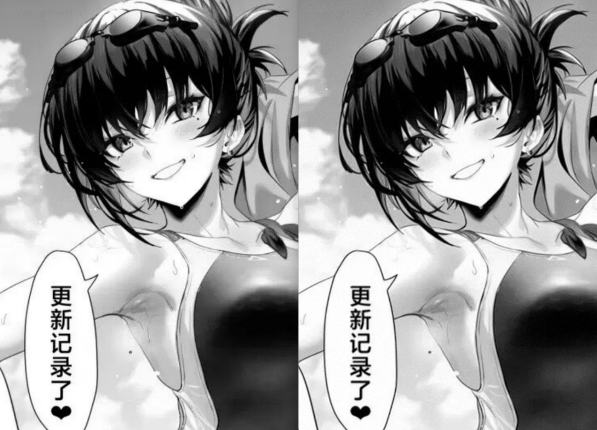

# ImagePolish

**[English](README.md) | [简体中文](README_zh.md)**

> 图像瑕疵修复工具

`imagepolish` 将 VapourSynth / AviSynth 生态中常用的图像滤镜（抗锯齿、降噪、去光晕、去色带、锐化、缩放）以独立 C++ 实现整合为一个命令行程序用于图像处理。



**上图所用参数：**

```bash
imagepolish -i input.png -denoise --deband range=12,y=60,cbcr=24 --deband range=24,y=40,cbcr=16 --aa 2 --sharpen 0.9 --dehalo --grain 10
```


## 特性

- **滤镜可任意组合**：EEDI2 抗锯齿、NLMeans 降噪、spline36 缩放、FineDehalo 去光晕、CAS 锐化、neo_f3kdb 去色带；按命令行出现顺序依次执行，可重复、可省略、顺序任意。
- **色彩高保真**：色度不经过有损的8 位 YUV 量化，而是把「亮度变化量」加回原图 RGB——色度零损失，与 VapourSynth `ShufflePlanes` 语义严格对应。
- **多文件批量处理**：`-i` 可重复传入，串行批处理，每个输入自动生成对应输出。
- **多线程加速**：滤镜处理通过多线程来加速。


## 快速开始

```bash
# 去色带 + 去锯齿，默认参数
imagepolish -i in.png --deband --aa

# 降噪（强度 5）+ 缩放到 1920 宽
imagepolish -i in.png --resize 1920x --denoise 5 -o out.png

# 批量处理多张图（-o 被忽略，输出为 <输入名>_output.<原扩展名>）
imagepolish -i a.png -i b.png -i c.png --deband y=40
```

省略 `-o` 时输出为 `<输入名>_output.<原扩展名>`（如 `in.png` → `in_output.png`）；全部步骤省略则原图直通输出。


## 使用说明

### 基础命令

| 选项 | 说明 |
|---|---|
| `-i, --input <file>` | 输入图片，可重复以批处理；格式：PNG / BMP / TGA / JPG / PGM / PPM / PNM，灰度或彩色均可 |
| `-o, --output <file>` | 输出路径，格式由扩展名决定（`.png` `.bmp` `.tga` `.jpg/.jpeg` `.pgm` `.ppm`）；缺省为 `<输入名>_output.<原扩展名>` |
| `--quality <q>` | JPEG 输出质量（`1~100`，默认 `80`，`92` 基本等于肉眼无损），仅对 `.jpg/.jpeg` 生效 |
| `-h, --help` | 打印帮助 |

### 滤镜

- 步骤按命令行出现顺序执行，每一步都在前一步的结果上继续。
- 同一个滤镜可多次调用

| 参数 | 含义 |
|---|---|
| `--resize WxH` | spline36 缩放，一侧可省略（`1920x` / `x1080`），另一侧按原宽高比计算 |
| `--denoise [N]` | NLMeans 降噪，`N` 为滤波强度 `h`（`1~8`，默认 `5`） |
| `--deband [name=value,...]` | 去色带（neo_f3kdb，sample_mode=2），`range`（`0~255`，默认 `24`）、`y`（`0~511`，默认 `72`）、`cbcr`（`0~511`，默认 `32`） |
| `--aa [N]` | 去锯齿，`N` 为强度（1、2，默认2） |
| `--sharpen [s]` | CAS 锐化，`s` 为 sharpness（`0~1`，默认 `0.7`） |
| `--dehalo` | 去光晕，参数固定 |
| `--grain [h]` | 胶片颗粒，`h` 为噪声方差（`0~100`，默认 `10`） |

示例：

```bash
imagepolish -i in.png --deband               # 默认 24,72,32
imagepolish -i in.png --deband y=40          # 只调亮度阈值
imagepolish -i in.png --deband range=16,cbcr=48
imagepolish -i in.png --resize 1920x --aa --deband --denoise 5 -o out.png
```

### 说明

- 滤镜顺序推荐按照上方的滤镜表格从上到下排，比如去锯齿不要放在降噪前。这样是为了取得更好的处理效果。

- aa去锯齿滤镜强度2虽然效果很好，但是会让画面微微变糊，可以适当增加一点锐化

- deband推荐使用两次以达到更有效地处理不同大小的色带的目的，比如：

  ```bash
  imagepolish -i in.png --deband range=12,y=60,cbcr=24 --deband range=24,y=40,cbcr=16
  ```

- 强烈推荐在最后面加 `--grain`，有一层噪点可以更加保护细节，减少修复后的涂抹感

- 如果你不懂具体滤镜的用法，也可以使用下面这个万能参数：

  ```bash
  imagepolish -i in.png --denoise --deband range=12,y=60,cbcr=24 --deband range=24,y=40,cbcr=16 --aa --sharpen 0.9 --dehalo --quality 92
  ```


## 构建

> **前置要求**：
>
> Python 3.x 与 pip。`pip install ziglang` 一个包即自带完整编译器（zig cc）与各目标平台的运行库，无需额外安装 LLVM / MinGW、也无需配置 PATH。

VS Code 用户直接运行 build 任务（`Ctrl+Shift+B`）即可：`build` 构建当前平台，`build all platforms` 交叉编译全部目标平台

**命令行构建：**

```bash
python build.py          # 当前平台 -> out/imagepolish.exe
python build.py --all    # 全平台 -> out/imagepolish-<版本>-<目标平台>[.exe]
```


## 实现方式

本项目并非调用插件，而是从参考实现逐行移植的独立 C++ 代码


### 彩色路径

彩色图处理时：取 BT.601 全范围亮度执行各步骤，色度不经过有损的 8 位 YUV 量化，而是把「亮度变化量」加到原图 RGB 的三个通道上——等价于 `ShufflePlanes([aa, src], YUV)` 的「只换亮度、色度原样保留」，且色度零量化误差。平坦区域往返零误差（实测 1000 个随机色全数精确；唯一例外是亮度恰为 `x.5` 的约 0.1% 颜色，会三通道整体 `+1`）。


### 滤镜

- **EEDI2**（tritical / HolyWu 算法 v0.9.2 的逐行移植）：14 个阶段流水线——边缘掩码 → 腐蚀/膨胀/去小水平缝隙 → 方向场计算（5 个候选方向，median 与 limlut 限幅）→ 方向场滤波/扩张/填缝 → 逐行拼接 → 2× 上采样 → 2× 方向场处理 → 晶格插值（噪声阈值 nt8 主搜索 + nt7 回退）→ 后处理。
- **重采样**：fmtconv 约定，`srcPos(o) = (o+0.5)·ratio - 0.5 + shift`（像素中心对齐），spline36 核按 `max(ratio, 1)` 缩放、按权值总和归一化； `--resize` 用同一内核、shift=0 的中心对齐缩放（可分离两趟：转置 → 纵向重采样 → 转置）。
- **Repair 模式 2**：取参考图 b 的 3×3 邻域排序后的 `clamp(a, n[1], n[7])`，边界行列直接复制 a。
- **NLMeans**（vs-nlm-ispc / KNLMeansCL drop-in 的移植，参数固定 d=0、a=2、 s=4、wmode=3、wref=1）：单帧空间降噪（d=0 不用时间邻域）。对 patch 上三角半区 12 个偏移逐像素求 `3·Δ²/255²`，经水平 9-tap、竖直 9-tap 滑动盒得到窗口距离 `d²`，权重 `w = max(1 - d²·κ, 0)⁸`，其中 `κ = 255²/(3·h²·81)`， h 由 `--denoise` 提供；聚合 `Σw` 与 `Σw·v` 后输出 `(wref·maxw·src + Σw·v)/(wref·maxw + Σw)`。
- **FineDehalo**（havsfunc `haf.FineDehalo` 的移植，参数固定为 havsfunc 默认： DeHalo_alpha rx=2/ry=2/darkstr=brightstr=1/lowsens=highsens=50/ss=1.5， FineDehalo thmi=80/thma=128/thlimi=50/thlima=100、excl=True）：DeHalo_alpha 去晕（Bicubic(a=1/3,b=1/3) 缩放的模糊晕层与其原图的差、1.5× Lanczos 上行采样 min/max 钳制再回落、亮度域混合）→ Prewitt 边缘 + 两档亮度阈值 （thmi/thma 主边缘、thlimi/thlima 弱边缘）、矩形/菱形形态学扩张-腐蚀、 3×3 盒卷积构造「排除区」→ `MaskedMerge` 只在掩码 255 处换成去晕结果。 Expr 步骤按参考实现的逐运算 float + round-half-even(rint) 语义复刻。
- **CAS**（HolyWu / VapourSynth-CAS 的移植，即 AMD FidelityFX CAS）：3×3 软 min/max 导出对比度自适应振幅 `amp = sqrt(clamp(min(mn, limit-mx)/mx))`，权重 `w = amp·(-1/lerp(16,5,s))`，输出十字滤波 `((b+d+f+h)·w+e)/(1+4w)`。
- **Deband**（neo_f3kdb `Deband(range,y,cb,cr,grainy=0,grainc=0, output_depth=16)` 的移植，即默认 sample_mode=2、blur_first=true、 random_algo_ref=UNIFORM、无 grain 无 dither）：8 位样本上采样进 16 位内部域（`<<8`，阈值按参考 `scale=false` 取 `y<<2`）；每像素由 LUT 中的随机距离 `ref1/ref2 ∈ [0, cur_range]`（`cur_range` 取 `range` 与四边距离的最小值，随机序列严格复刻参考 `init_frame_luts`：每像素按 Y/ref1/ref2/Cb/Cr 顺序推进同一个 LCG 种子）取 4 个对角参考点，用参考 SSE 例程的 `avg_4`（第一对平均后饱和减 1，再与第二对平均）求 16 位均值；仅当 `|avg - px| >= threshold` 时保留原值，否则用均值，最后 `>>8` 回到 8 位。与其它步骤一致，只作用于亮度平面（`cb/cr` 参数为兼容参考调用而保留）。
- **Grain**（VapourSynth-AddGrain 的移植，即 `core.grain.Add`；原始算法为 Tom Barry / Firesledge 的 AddGrain，VapourSynth 移植由 HolyWu 完成）：32 位 LCG（`idum = 1664525·idum + 1013904223`）+ Box-Muller 极坐标法（第二个样本存入 `gset` 状态留待下次调用）生成标准正态样本，乘 `√var` 得 `N(0, var)`；逐像素独立取噪（参考 `hcorr/vcorr` 默认 0，即无水平/垂直相关性平滑），`round` 成 int8 增量后加到原像素并整体钳制 `[0,255]`。与参考的差异：参考默认以系统时间为种子、并为多帧视频预生成 2 倍高噪声场再滚动取窗；本工具以图像内容的 FNV-1a 哈希为种子直接逐像素绘制（静态单帧等效），使同一输入结果可复现。`var <= 0` 直通。


### 对比

在真实 VapourSynth 环境（vapoursynth pip 包 + eedi2 / fmtconv / RemoveGrainVS / nlm_ispc / cas / neo-f3kdb 插件）下逐像素对比：

| 环节 | 对比方式 | 结果 |
|---|---|---|
| EEDI2（8bit） | 与 eedi2.dll 输出直接比 | 100% 逐像素一致 |
| Repair（模式 2，8bit） | 与 RemoveGrainVS.dll 输出直接比 | 100% 逐像素一致 |
| spline36 重采样 | 与 fmtconv 16bit 输出 >>8 比 | 100% 像素差 ≤1 |
| 整条 AA 链 | VS 全程 16bit >>8 vs 本工具 8bit | 100% 像素差 ≤2，99.9% ≤1 |
| NLMeans（8bit） | 与 nlm_ispc.dll 直接比（多参数 / 多尺寸） | 100% 逐像素一致 |
| FineDehalo（8bit） | 与 havsfunc（全部默认参数）直接比 | 结构与掩码一致；光晕区像素差 ≤24（内部 resize 内核的浮点细节差异） |
| CAS（8bit） | 与 cas.dll（sharpness=0.7）直接比 | 99.3% 逐字节一致，其余像素差 ≤2（插件 AVX2/AVX512 中间顺序重排所致） |
| Deband（8bit） | 与 neo-f3kdb.dll r7（多组 range/y，输出 GRAY16）的 >>8 直接比 | 100% 逐像素一致 |
| Grain（8bit） | 与 addgrain.dll（`core.grain.Add`，var=40）噪声统计对比 | 标准差/均值一致（差 <0.1%；种子不同，逐像素不可比） |

其中 Deband 的对比覆盖了 480×320、386×277、300×220、333×241 等多尺寸与多组参数（含 `y=0` 边界，此时输出应与原图一致）；整条链的水平与此一致。


## 许可

本项目代码以 **MIT 许可证** 发布，详见 [LICENSE](LICENSE)。

本项目的滤镜是对 VapourSynth / AviSynth 生态开源实现（包括但不限于 VapourSynth-EEDI2 等）的独立移植：以算法行为规格为参照、在注释中标注参考来源，代码为本项目独立编写。
